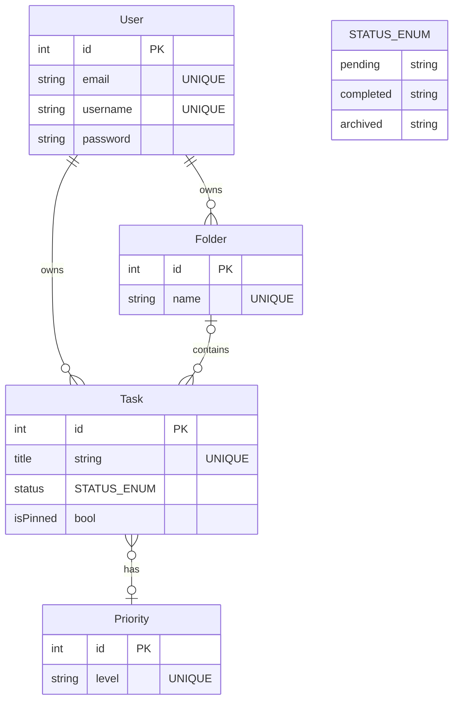

# phase3-symfony-tasklist-reloaded
Une application de gestion de tâches priorisées et organisées en dossiers. Développée avec Symfony.

# Projet TaskList Reloaded
Le bon vieux Tasklist, c'est le projet CRUD classique idéal pour faire un tour d'horizon de Symfony. :)

*Have fun and don't forget to `symfony console cache:clear`*

> Ici se trouve le cahier des charges fonctionnel et une partie du cahier des charges non fonctionnel (le schéma de la base de données).

## Objectif pédagogique : le CRUD, les relations SQL simples et l'authentification.

## Critères d'évaluation :
|Critères|Description|
|-|-|
|MVP|Epic 1 : Gestion des tâches |
|Respect de la maquette |
|   Implémentation du diagramme UML pour la BDD|
| Authorization | Routes privées et publiques|
| Readme.md Documenter le déploiement | Rédigez un Readme qui explique comment lancer l'application à partir d'un serveur ou d'un PC neuf |
|V2 (bonus) | Epic 2 : Organisation & Tri |

## Cahier des charges fonctionnel

### Synopsis
Une application de gestion de tâches priorisées et organisées en dossiers. Développée avec Symfony.

### Maquette

Maquette interactive :
https://www.figma.com/proto/O1CFvazkgkjUsdGpVpozRj/Untitled?node-id=4-823&t=S5RtpiUl6nNUacow-1&scaling=min-zoom&content-scaling=fixed&page-id=0%3A1&starting-point-node-id=4%3A823&show-proto-sidebar=1

### Epic 1 : Gestion des tâches

- User Story 1 : En tant qu'utilisateur, je veux créer une tâche avec un titre et une priorité afin d'organiser ma journée.
    - CA 1 : L'utilisateur peut créer ses propres priorités.
    - CA 2 : Les priorités disponibles par défaut sont : "urgent", "important", "normal".

- User Story 2 : En tant qu'utilisateur, je veux marquer le statut d'une tâche comme terminée afin de suivre mon avancement.
    - CA 1 : Une tâche peut avoir les statuts suivants : "en cours", "terminée", "archivée".
    - CA 2 : Les tâches archivées se retrouvent à la fin de la liste des tâches.
    - CA 3 : Les tâches terminées se retrouvent juste avant les tâches archivées et leur titre est barré.
    - CA 4 : Les tâches en cours apparaissent juste avant les tâches terminées dans la liste des tâches.

- User Story 3 : En tant qu'utilisateur, je veux épingler mes tâches les plus importantes afin qu'elles restent visibles en haut de ma liste.
    - CA 1 : Je clique sur l'icône épingle d'une tâche pour l'épingler.

- User Story 4 : En tant qu'utilisateur, je veux pouvoir m'inscrire et me connecter afin d'accéder à mes tâches personnelles.
    - CA 1: L'utilisateur peut s'inscrire avec un e-mail, un nom d'utilisateur et un mot de passe.
    - CA 2: L'utilisateur peut se connecter avec son e-mail et son mot de passe.
    - CA 3: Les mots de passe sont stockés de manière sécurisée (par exemple, avec un hachage).

### Epic 2 : Organisation & Tri

- User Story 1 : En tant qu'utilisateur, je veux créer des dossiers thématiques afin de regrouper mes tâches par projet.
    - CA 1 : Un dossier créé doit être nommé.
    - CA 2 : Je peux associer une couleur à un dossier.

- User Story 2 : En tant qu'utilisateur, je veux filtrer mes tâches par statut ou par priorité afin de me concentrer sur l'essentiel.
    - CA 1 : Je peux filtrer les tâches par statut (en cours, terminée, archivée).
    - CA 2 : Je peux filtrer les tâches par priorité (urgent, important, normal).

## Cahier des charges non fonctionnel (technique et implémentation)

## UML

### EntityRelation

